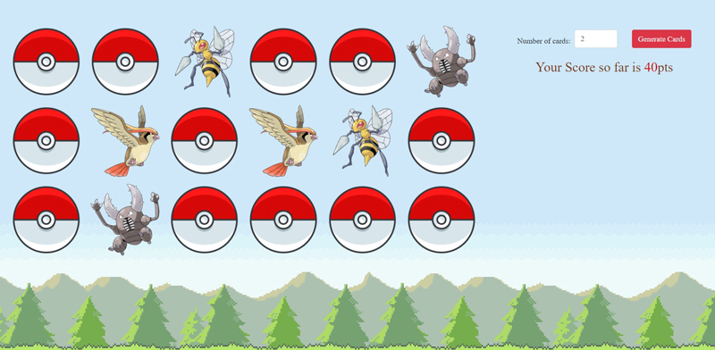

## React Memory Game(Pokemon)
### Introduction
This project's goal is to practice react states and hooks.
Since pokemon resources are easily available, I choosed it as the theme of the project. 
The game will go through these steps:
   - Pick the number of cards that you'd like to play, the cards are randomly generated with diffrent pokemons each round!.
   - Calculate and display your score with each turn.
   - Display your total score with a message depending on your score.

## Getting Started
Heroku URL:  `https://memory-card-pokemon.herokuapp.com/` 
Locally URL: `http://localhost:3000/` 

### Running Locally
   - Clone the repository by typing (git clone URL) or download it.
   - You will need node and npm installed type (npm install).
   - To start the app locally type (npm start).

## Resources:
Images: `https://pokedevs.gitbook.io/pokedex/resources/meta` 
Style: Bootstrap `https://getbootstrap.com/`

## Project Screen Shot:
